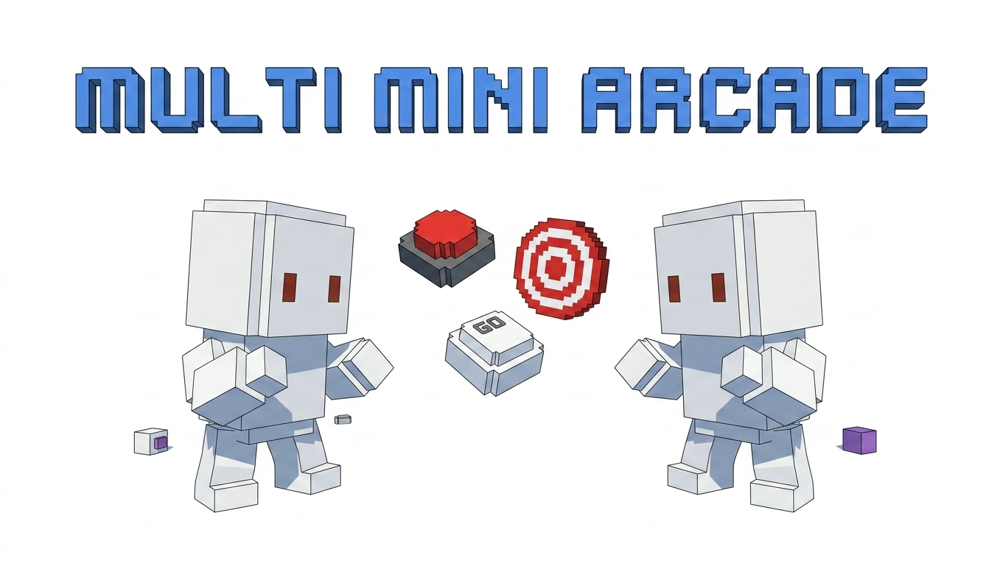

> **Project Title:** MULTI MINI ARCADE
> 
> 

 **Student No / Name / E-mail:** (22113291, 강헌구, hungu020717@gmail.com)

 https://github.com/Hungu39/OpensourceSW-project

 

## [ Revision history ]

| Revision date | Version # | Description | Author |
| :--- | :--- | :--- | :--- |
| 06/01/2026 | 0.1 | 클래스 다이어그램 작성 | 강헌구 |
| 06/02/2026 | 0.1 | 시퀀스 다이어그램 작성 | 강헌구 |
| 06/04/2026 | 0.1 | 스테이트머신 다이어그램 작성 | 강헌구 |

 

---

## 1. Introduction

### 1. Summary
현대 사람들은 친구들과 함께 어울리며 즐길 수 있는 멀티플레이 게임을 선호한다. 하지만 최근의 네트워크 게임들은 복잡한 시스템과 긴 플레이 타임을 요구하여, 가볍고 빠르게 내기나 경쟁을 즐기기에는 부담스러운 경우가 많다. 이에 복잡한 룰이나 성장 요소 없이 오직 플레이어의 '순수 피지컬'만을 겨루며 직관적이고 빠른 재미를 추구하는 사람들을 위해 기획한 게임이 바로 "MULTI MINI ARCADE"이다.

### 2. Introduce "MULTI MINI ARCADE"
이번에 제작하게 된 게임 "MULTI MINI ARCADE"는 포톤(Photon) 네트워크를 기반으로 한 2인용 멀티플레이 미니게임 모음집이다. 해당 게임은 단순하지만 확실한 경쟁 요소를 가지는 '반응속도 대결', '에이밍 대결', '타자 대결' 총 3가지의 직관적인 미니게임으로 구성된다. 플레이어들은 로비 시스템을 통해 방을 생성하거나 참가하여 1:1 매칭을 진행하며, 짧은 시간 안에 서로의 순발력과 정확도를 측정하고 승패를 가르는 순수한 경쟁의 재미를 제공한다.

### 3. Goal
이번 Analysis 보고서에서는 Use case analysis와 Domain analysis을 진행하고 시스템이 어떻게 구성되었는가를 소개한다. 해당 보고서를 읽고 나면 "MULTI MINI ARCADE"의 멀티플레이 로비 세션 관리부터 각 미니게임 플레이 로직, 그리고 점수 동기화까지 전체적인 네트워크 게임 시스템이 어떤 방식으로 진행되고 동작하게 되는지 알 수 있을 것이다.

 

## 2. Class diagram

해당 클래스 다이어그램은 Multi-Mini Arcade의 로비, 대기방, 그리고 3종의 미니게임 및 결과 창을 제어하는 핵심 매니저(Manager) 클래스들을 표현한 다이어그램이다. 

실제 구현에는 UI나 자잘한 이펙트를 관리하는 스크립트들이 더 포함되지만, 본 다이어그램에서는 게임의 주요 로직과 네트워크 통신을 담당하는 핵심 요소들만 추려서 나타내었다. 다이어그램에 나타난 대부분의 매니저 클래스는 유니티 스크립트의 기본인 `MonoBehaviour`와 포톤 네트워크 제어를 위한 `MonoBehaviourPunCallbacks`를 상속받아 동작한다. 또한, 멀티플레이 특성상 클라이언트 간 동기화를 위해 다수의 `public` 메서드와 RPC(Remote Procedure Call) 메서드가 포함되어 있는 것이 특징이다.

기능별로 연관된 클래스들을 묶어서 설명한다.

### [Lobby & Waiting Room System]
서버 접속부터 게임 시작 전까지의 준비 과정을 담당하는 클래스들이다.

| 클래스명 | 설명 |
| :--- | :--- |
| **LobbyManager** | 닉네임 설정, 유효성 검사, 방 생성 및 참가 등 로비 씬에서의 전반적인 네트워크 연결을 관리하는 클래스이다.  + `OnClickCreateRoom() / OnClickJoinRoom()`: 유저의 UI 버튼 입력을 받아 방 생성 및 참가를 서버에 요청한다. + `OnJoinedRoom()`: 방 입장에 성공했을 때 대기방 씬으로 전환하는 콜백 메서드이다. |
| **WaitingRoomManager** | 게임룸에 입장한 플레이어들의 레디 상태를 관리하고, 인원이 모두 모였을 때 게임 씬으로 이동시키는 역할을 한다.  + `SetReady()`: 플레이어의 준비 상태를 토글하는 메서드이다. + `OnPlayerEnteredRoom() / OnPlayerLeftRoom()`: 다른 유저가 들어오거나 나갈 때 UI를 갱신하고 예외를 처리한다. |
| **WaitingRoomChat** | 대기방 내부에서 플레이어 간 텍스트 채팅 기능을 수행하는 클래스이다.  + `SendChatMessage()`: 입력된 텍스트를 서버로 전송한다. + `RPC_ReceiveChat()`: 상대방이 보낸 메시지를 수신하여 로컬 UI 화면에 업데이트한다. |

 

### [Mini Game Managers]
실제 3가지 미니게임 씬 내부의 규칙, 타이머, 승패 판정을 제어하는 클래스들이다.

| 클래스명 | 설명 |
| :--- | :--- |
| **ReactionGameManager** | '반응속도 대결' 미니게임의 내부 로직을 관리하는 클래스이다. 무작위 대기 시간 생성, 화면 신호 변경, 플레이어 반응 측정 기능을 가진다.  + `RandomWaitCoroutine()`: 신호가 변경되기 전까지의 무작위 대기 시간을 제어한다. + `OnScreenClicked()`: 플레이어의 클릭 입력을 감지한다. + `RPC_SubmitTime()`: 클릭이 유효할 경우, 서버로 자신의 반응 속도를 제출하고 동기화한다. |
| **AimingGameManager** | '에이밍 대결' 미니게임의 내부 로직을 관리하는 클래스이다. 표적의 스폰과 클릭 판정, 제한 시간을 제어한다.  + `SpawnTarget()`: 화면 내 무작위 위치에 표적을 생성한다. + `OnTargetClicked()`: 표적을 성공적으로 클릭했을 때 로컬 점수를 올린다. + `RPC_AddAimingScore()`: 획득한 점수를 상대방 클라이언트에도 동기화시킨다. |
| **TypingGameManager** | '타자 대결' 미니게임의 로직을 관리한다. 제시어를 띄우고 유저의 입력이 정확한지 검증하는 클래스이다.  + `SpawnInitialWords()` / `RPC_SyncInitialWords()`: 양쪽 플레이어의 화면에 동일한 제시어가 나타나도록 단어 데이터를 세팅하고 동기화한다. + `OnInputSubmit()`: 유저가 제출한 단어의 정답 여부를 판별한다. + `RPC_StealWord()`: 정답을 맞힌 경우 단어의 소유권을 가져오고 점수를 갱신한다. |

 

### [Score & Result System]
게임 전반에 걸친 점수 누적과 최종 결과 출력을 담당하는 클래스들이다.

| 클래스명 | 설명 |
| :--- | :--- |
| **TotalScoreManager** | 3개의 라운드가 진행되는 동안 각 미니게임에서 획득한 승점을 누적하여 저장하는 데이터 클래스이다.  + `hostTotalScore / guestTotalScore`: 방장과 게스트의 누적 승점을 저장하는 변수이다. + `ResetScores()`: 모든 게임이 끝나고 다음 게임을 위해 누적 점수를 초기화한다. |
| **FinalResultManager** | 모든 미니게임 라운드가 종료된 후 최종 승패를 계산하여 UI에 출력하고 씬을 제어하는 클래스이다.  + `Start()`: 씬 로드 시 TotalScoreManager의 데이터를 바탕으로 승자를 판별한다. + `ReturnToWaitingRoom()`: 결과를 일정 시간 출력한 뒤 자동으로 대기방 씬으로 플레이어들을 복귀시킨다. |

 

### 3. Sequence diagram

#### 1) Connection MasterServer

Connection MasterServer Use case에서의 Sequence Diagram이다. 플레이어가 게임을 시작(`Start()`)하면 LobbyManager에서 포톤 서버로 접속(`ConnectUsingSettings()`)을 요청한다. 

포톤 서버와의 네트워크 연결에 성공하여 서버로부터 확인(`OnConnectedToMaster()`)을 받으면, LobbyManager는 즉시 로비 참가를 위한 명령(`JoinLobby()`)을 서버에 전달한다. 반대로 연결에 실패하여 서버로부터 끊김 판정(`OnDisconnected()`)을 받게 되면, 접속에 성공할 때까지 지속적으로 재접속(`ConnectUsingSettings()`)을 시도하는 루프(Loop) 과정을 수행한다.

 

#### 2) SetNickname

SetNickname Use case에서의 Sequence Diagram이다. 플레이어가 닉네임을 입력하고 방 만들기 또는 방 입장 버튼을 누르면, LobbyManager에서 입력된 닉네임의 유효성 검사(VerifyNickname)를 수행한다. 

만약 닉네임을 입력하지 않은 상태(`[닉네임 안썼을때]`)라면 LobbyManager는 에러 팝업창을 띄우고(`ErrorPopup.SetActive(true)`) 로직을 중단(`return`)한다. 반대로 닉네임이 정상적으로 입력된 상태(`[else]`)라면, 포톤 서버에 해당 닉네임을 할당한 후 서버로 방 생성 또는 방 참가(`CreateRoom(), JoinRandomRoom()`)를 요청한다.

 

#### 3, 4) Create Room & Join Gameroom

Create Room 및 Join Gameroom Use case를 통합한 Sequence Diagram이다. 플레이어가 닉네임을 입력하면(`NickName = nicknameInputField.text`), LobbyManager는 가장 먼저 닉네임 누락 여부를 확인한다. 

닉네임이 비어있는 경우 에러 팝업(`ErrorPopup`)을 띄워 로직을 처리한다. 닉네임이 정상적으로 입력된 상태(`[else]`)에서 서버에 참여할 수 있는 방이 없을 경우, 플레이어의 방 만들기 입력(`OnClickCreateRoom`)을 받아 포톤 서버에 새로운 방 생성(`CreateRoom`)을 요청한다. 반대로 참여 가능한 방이 이미 존재하는 경우(`[else]`), 방 참가 입력(`OnClickJoinRoom`)을 받아 서버에 무작위 방 입장(`JoinRandomRoom`)을 요청한다.

 

#### 5) Start Game

Start Game Use case에서의 Sequence Diagram이다. 방장(Master Client)이 대기방에 있는 모든 플레이어가 준비되었는지 상태를 확인(`CheckReadyStatus`)한다. 

만약 모든 인원이 준비를 완료한 상태(`[allready == true]`)라면, 방장의 시작 버튼 클릭(`OnClickAction`)을 받아 WaitingRoomManager가 포톤 서버에 첫 번째 미니게임 씬으로의 전환(`LoadLevel("ReactionGameScene")`)을 요청한다. 반대로 모든 인원이 준비되지 않은 경우(`[else]`), WaitingRoomManager는 시작 버튼을 비활성화(`actionButton.interactable = false`)하여 게임이 시작되지 않도록 제어한다.

 

#### 6) ReactionSpeedTest

ReactionSpeedTest Use case에서의 Sequence Diagram이다. ReactionGameManager가 새로운 라운드를 시작(`StartNewRound`)하고, 무작위 대기 시간이 지나면 플레이어의 화면을 붉은색으로 변경하는 신호(`RPC_TurnRed`)를 보낸다. 

이를 본 플레이어가 화면을 클릭(`OnScreenClicked`)하면, ReactionGameManager는 클릭한 타이밍의 유효성을 검사(`CheckClickTiming`)한다. 화면이 붉게 변하기 전 대기 상태(`[isWaitingRed == true]`)에서 클릭했다면 부정 출발(`FailStart`)로 처리된다. 반대로 신호가 변경된 후 정상적으로 클릭했다면(`[else]`), 포톤 서버를 통해 자신의 반응 측정 시간을 전송(`RPC_SubmitTime`)한다.

이후 두 플레이어의 기록이 모두 제출되어 종료 조건(`[submitCount == 2]`)이 충족되면, 승자를 판별(`DetermineWinner`)한 뒤 다음 라운드인 에이밍 게임 씬으로 이동(`LoadLevel("AimingGameScene")`)한다.

 

#### 7) AimingTest

AimingTest Use case에서의 Sequence Diagram이다. 플레이어가 표적을 성공적으로 클릭(`[타겟 클릭 성공]`)하면 `OnTargetClicked` 입력이 전달되고, AimingGameManager는 포톤 서버를 통해 실시간으로 점수를 동기화(`RPC_AddAimingScore`)한 뒤 로컬 점수를 갱신(`UpdateScore`)한다.

동시에 게임 타이머를 확인(`CheckTimer`)하여 제한 시간이 남아있는 경우(`[GameTime > 0]`)에는 게임을 계속 진행한다. 반대로 제한 시간이 모두 종료된 경우(`[else]`), AimingGameManager는 승자를 판별(`DetermineWinner`)한 뒤 TotalScoreManager에 누적 승점(`totalscore++`)을 업데이트한다. 이후 다음 라운드를 준비(`GotoTypingGame`)하며 서버에 타자 게임 씬으로의 전환(`Loadlevel("TypingGameScene")`)을 요청한다.

 

#### 8) TypingTest

TypingTest Use case에서의 Sequence Diagram이다. 게임이 시작되면 TypingGameManager는 화면에 단어를 생성(`SpawnInitialWords`)하고, 양쪽 플레이어의 화면이 동일하도록 서버에 동기화(`RPC_SyncInitialWords`)를 요청한다.

플레이어가 단어를 입력하고 제출(`OnInputSubmit`)하면, 시스템은 입력값의 유효성을 검사(`CheckTypingInput`)한다. 입력한 단어가 화면에 존재하는 정답일 경우(`[입력한 단어가 화면에 존재할때]`), 서버를 통해 해당 단어의 소유권을 가져오고(`RPC_StealWord`) 입력창을 초기화(`ResetInputFieldCoroutine`)한다. 만약 오타이거나 없는 단어일 경우(`[else]`), 점수 획득 없이 입력창만 초기화한다.

동시에 게임 타이머를 확인(`CheckGameend`)하여 시간이 남아있다면(`[GameTime > 0]`) 게임을 계속 진행한다. 제한 시간이 종료되면(`[else]`), 승자를 판별(`DetermineWinner`)하여 TotalScoreManager에 점수를 업데이트(`UpdateScore`)한다. 마지막으로 모든 미니게임 종료 루틴을 실행(`EndAllGames`)한 뒤, 서버에 최종 결과창 씬으로의 전환(`LoadLevel("FinalResultScene")`)을 요청한다.

 

#### 9) View Result

View Result Use case에서의 Sequence Diagram이다. 결과 화면에 진입하면 FinalResultManager는 가장 먼저 TotalScoreManager에게 최종 누적 점수 데이터를 요청(`점수데이터요청`)한다.

이후 두 플레이어의 점수를 비교(`DetermineFinalWinner`)하여 방장의 점수가 더 높으면(`[finalHost > finalGuest]`) 방장 승리를, 게스트의 점수가 더 높으면(`[finalGuest > finalHost]`) 게스트 승리를 `winnerText.text`에 띄워주고, 동점일 경우(`[else]`) 무승부(`draw`)를 화면에 출력한다. 

결과 출력 후, 대기방으로 돌아가기 위한 대기 시간 코루틴을 실행(`StartCoroutine(ReturnToWaitingRoom())`)하고, 다음 게임을 위해 TotalScoreManager의 점수를 0으로 초기화(`ResetScore`)한다. 마지막으로 현재 클라이언트가 방장일 경우에만(`[PhotonNetwork.IsMasterClient == true]`), 포톤 서버에 대기방 씬으로의 씬 전환(`LoadLevel("WaitingRoomScene")`)을 요청하여 두 플레이어를 자동으로 복귀시킨다.
